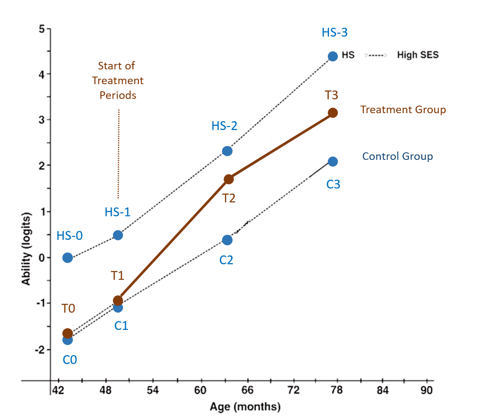
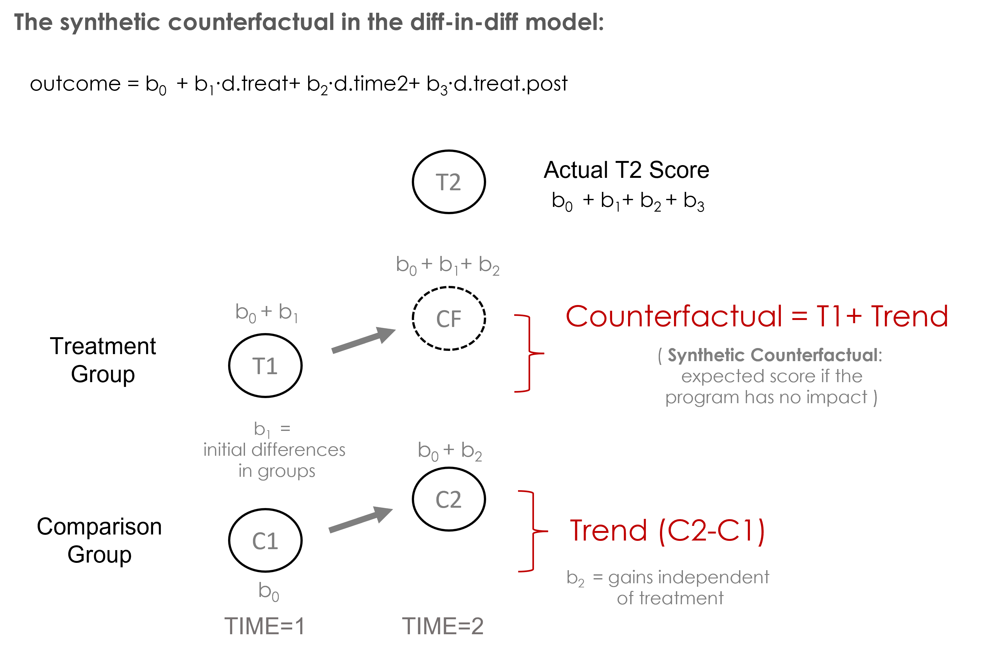
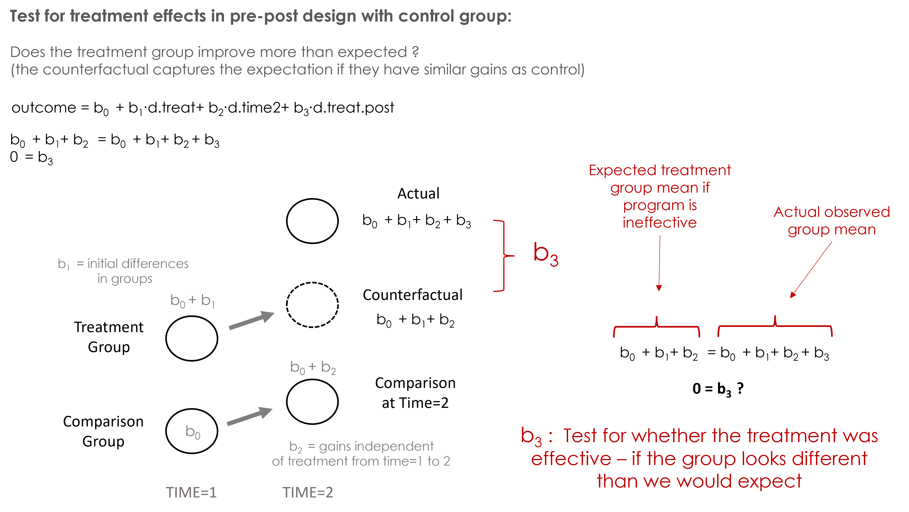
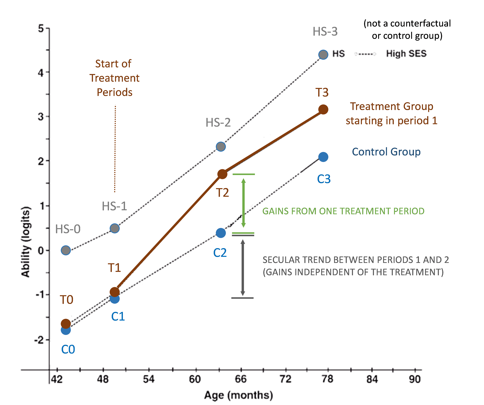

```{r setup, include=FALSE}
knitr::opts_chunk$set( echo=T, message=F, warning=F, image.width=10)
```


# Overview

This lab is loosely based on results from:

> Bingham, R., & Felbinger, C. (2002). *Evaluation in practice: A methodological approach.* CQ Press.

[CH-05: Improving Cognitive Ability in Chronically Deprived Children](https://ds4ps.org/cpp-524-sum-2021/pubs/eval-in-practice-CH5-randomized-control-trial.pdf)

The treatment is nutrition support and specialized tutoring for low-SES students in a poor neighborhood in Peru. The outcome is a standardized measure of academic ability. 

Instead of four distinct treatment groups and five time periods this lab will use one treatment group, one control group, and one comparison group (the high socio-economic status students). 

The treatment group starts treatment in the first time period and continues to receive it in periods 2 and 3 in the study. Neither the control group nor the comparison group receive the treatment at any point. 




```{r, fig.height=8, fig.width=8, eval=F, echo=F}

# CODE TO GENERATE A SYNTHETIC DATASET
#
# Notes for future updates of the lab only (create new data).
# Do not run this chunk otherwise.

# -----------------------------------------------
#     &nbsp;       time0   time1   time2   time3 
# --------------- ------- ------- ------- -------
#  **high.ses**    -0.22   1.44    3.15    4.61  
# 
#  **treatment**   -1.76   -0.72   2.19    3.34  
# 
#   **control**    -1.76   -0.65   0.64      2   
# -----------------------------------------------
  
g.hs.0 <- -0.12
g.hs.1 <-  1.29
g.hs.2 <-  2.89
g.hs.3 <-  4.45
n.hs <- 28

g.t.0 <- -1.80
g.t.1 <- -0.82
g.t.2 <-  1.75
g.t.3 <-  3.21
n.treat <- 47

g.c.0 <- -1.79
g.c.1 <- -0.77 
g.c.2 <-  0.55
g.c.3 <-  1.93
n.control <- 90

HS0 <- g.hs.0 + rnorm( n=n.hs, sd=1.15 ) %>% sort()
HS1 <- g.hs.1 + rnorm( n=n.hs, sd=1.15 ) %>% sort()
HS2 <- g.hs.2 + rnorm( n=n.hs, sd=1.15 ) %>% sort()
HS3 <- g.hs.3 + rnorm( n=n.hs, sd=1.15 ) %>% sort()

T0 <- g.t.0 + rnorm( n=n.treat, sd=1.15 ) %>% sort()
T1 <- g.t.1 + rnorm( n=n.treat, sd=1.15 ) %>% sort()
T2 <- g.t.2 + rnorm( n=n.treat, sd=1.15 ) %>% sort()
T3 <- g.t.3 + rnorm( n=n.treat, sd=1.15 ) %>% sort()

C0 <- g.c.0 + rnorm( n=n.control, sd=1.15 ) %>% sort()
C1 <- g.c.1 + rnorm( n=n.control, sd=1.15 ) %>% sort()
C2 <- g.c.2 + rnorm( n=n.control, sd=1.15 ) %>% sort()
C3 <- g.c.3 + rnorm( n=n.control, sd=1.15 ) %>% sort()


ability.hs        <- c( HS0, HS1, HS2, HS3 )
ability.treatment <- c( T0, T1, T2, T3 )
ability.control   <- c( C0, C1, C2, C3 )


# Then create a set of group vectors, in this case 3 groups and 4 time periods.

# sample size:
# hs: 28 x 4 time periods
# treat: 47 x 4 time periods
# control: 90 x 4 time periods

period.labels <- c("time0","time1","time2","time3")

high.ses <- rep( "high.ses", length(ability.hs) )
study.period.hs <- rep( period.labels, each=n.hs )

treat <- rep("treatment", length(ability.treatment))
study.period.treat <- rep( period.labels, each=n.treat )

control <- rep("control", length(ability.control))
study.period.control <- rep( period.labels, each=n.control )


d1 <- data.frame(  ability=ability.hs, 
                   group=high.ses, 
                   time=study.period.hs )
d2 <- data.frame(  ability=ability.treatment, 
                   group=treat,       
                   time=study.period.treat )
d3 <- data.frame(  ability=ability.control, 
                   group=control,       
                   time=study.period.control )

# with all three groups 
d <- rbind( d1, d2, d3 )

# set factor levels 
d$group <- factor( d$group, 
                   levels=c("high.ses","treatment","control"))

tapply( d$ability, list(d$group,d$time), mean ) %>% 
  round(2) %>% 
  pander()
  


t <- tapply( d$ability, list(d$group,d$time), mean )

x <- 0:3
plot.new()
plot.window( xlim=c(0,3), ylim=c(-2,5) )
abline( h=-2:5, lty=2, col="gray80" )
points( x, t[1,], type="b", pch=19, col="steelblue", cex=3 )
points( x, t[2,], type="b", pch=19, col="darkred", cex=3 )
points( x, t[3,], type="b", pch=19, col="steelblue", cex=3 )
axis( side=1, at=0:3 )
axis( side=2, las=1 )
title( xlab="Study Periods", ylab="Academic Performance" )
title( main="Average Outcomes of Study Groups" )
```


```{r, eval=F, echo=F}
# saveRDS( d, "data/counterfactuals.rds" )
# write.csv( d, "data/counterfactuals.csv", row.names=F )
```


# Load Data

```{r}
library( dplyr )
library( scales )
library( stargazer )
library( pander )

# STARGAZER OUTPUT
#
# Use:
#
#   s.type="text"
#
# while running chunks interactively
# to see table output.
# This sets it to "html"
# when knitting the file.
s.type="html"
```


```{r, eval=F, echo=F}
s.type="text"
```


```{r}
URL <- "https://github.com/DS4PS/cpp-524-sum-2021/blob/main/labs/data/counterfactuals.csv?raw=true"
d <- read.csv( URL )

# set factor levels
d$group <- factor( d$group, 
                   levels=c("high.ses","treatment","control"))
```


## Table 1: Sample sizes for each group in the panel

```{r}
table( d$group,d$time ) %>% pander()
```


## Table 2: Group means in each time period 

```{r}
tapply( d$ability, list(d$group,d$time), mean ) %>% 
  round(2) %>% 
  pander()
```


```{r, fig.height=8, fig.width=8, echo=F}

t <- tapply( d$ability, list(d$group,d$time), mean )

x <- c(42,50,64,78)
plot.new()
plot.window( xlim=c(40,90), ylim=c(-2,5) )
abline( h=-2:5, lty=2, col="gray70" )
abline( h=-1.5:4.5, lty=3, col="gray85" )
points( x, t[1,], type="b", pch=19, col="steelblue", cex=3 )
points( x, t[2,], type="b", pch=19, col="darkred", cex=3 )
points( x, t[3,], type="b", pch=19, col="steelblue", cex=3 )
axis( side=1 )
axis( side=2, las=1 )
title( xlab="Age (months)", ylab="Ability (logits)" )
title( main="Average Outcomes of Study Groups" )

text( 80, t[1,4], "High SES", col="steelblue", pos=4 )
text( 80, t[2,4], "Treatment Group", col="darkred", pos=4 )
text( 80, t[3,4], "Control Group", col="steelblue", pos=4 )

segments( x0=50, y0=-2, y1=3.2, lty=3, col="darkred" )
text( 50, 3.7, "Start of \nTreatment \nPeriods", col="darkred" )

```


# Reflexive Pre-Post Estimator (T2-T1)


```{r, fig.height=8, fig.width=8, echo=F}

t <- tapply( d$ability, list(d$group,d$time), mean )

x <- c(42,50,64,78)
plot.new()
plot.window( xlim=c(40,90), ylim=c(-2,5) )

segments( x0=50, y0=-2, y1=3.1, lty=3, col="gray50" )
text( 50, 3.5, "Start of \nTreatment \nPeriods", col="gray50" )

abline( h=-2:5, lty=2, col="gray70" )
abline( h=-1.5:4.5, lty=3, col="gray85" )
points( x, t[1,], type="b", pch=19, col="steelblue", cex=3 )
points( x, t[2,], type="b", pch=19, col="steelblue", cex=3 )
points( x, t[3,], type="b", pch=19, col="steelblue", cex=3 )
axis( side=1 )
axis( side=2, las=1 )
title( xlab="Age (months)", ylab="Ability (logits)" )
title( main="Average Outcomes of Study Groups" )

text( 80, t[1,4], "High SES", col="steelblue", pos=4 )
text( 80, t[2,4], "Treatment Group", col="steelblue", pos=4 )
text( 80, t[3,4], "Control Group", col="steelblue", pos=4 )


points( x[2:3], t[2,2:3], 
        type="b", pch=19, col="darkred", cex=4, lwd=2, lty=3 )

text( x[2:3], t[2,2:3], labels=c("T1","T2"), 
      col="darkred", cex=1.5, pos=3, offset=1 )
```

Isolate all of the students in the treatment group from time periods 1 and 2 only. 

The T1 measure represents cognitive ability of students in the group at the start of the treatment period. T2 represents cognitive ability after one season of participation in the program. 

The post-treatment dummy created here will be 1 for each observation in time2 and 0 for each observation in time1.

```{r, echo=F}

df <- data.frame( 
       student=c("student_1","...","student_k","student_1","...","student_k"),
       group="treatment",
       time=rep(c("time1","time2"), each=3),
       post.dummy=rep(c(0,1),each=3) )

df %>% pander()
```

The regression model is then: 

$$ y = b_0 + b_1 * post.dummy + e $$


```{r, results="asis"}
dm <- filter( d, 
              group %in% c("treatment") &
              time %in% c("time1","time2") )

dm$post.dummy <- ifelse( dm$time=="time2", 1, 0 )

m <- lm( ability ~ post.dummy, data=dm )

stargazer( m, type=s.type, 
           omit.stat=c("f","ser","adj.rsq"),
           intercept.top=TRUE, intercept.bottom=FALSE,
           digits=2 )
```

## Question 1a

**What is the average score for kids in the treatment group in period 1 of the study? What is the average score for the same kids in period 2?** 

**Note, you can check your answers against the group means in Table 2 above.**


## Question 1b

**Explain what it means when b0 is statistically significant in the reflexive model. Explain what it means when b1 is statistically significant.** 

## Question 1c

**What is the effect size according to this model?** 

<br>
<hr>
<br>

Recall that the identifying assumption of a reflexive model (T2-T1) is that there is no secular trend, i.e. we would expect no gains in the study period for a group that does not receive the treatment. 

Is the reflexive model appropriate here? Is the zero trend assumption met? 

Test for zero trend assumption: C1=C2 or C2-C1=0


```{r, fig.height=6, fig.width=7, echo=F}

x <- c(42,50,64,78)
plot.new()
plot.window( xlim=c(40,90), ylim=c(-2,5) )

segments( x0=50, y0=-2, y1=3.1, lty=3, col="gray50" )
text( 50, 3.5, "Start of \nTreatment \nPeriods", col="gray50" )

abline( h=-2:5, lty=2, col="gray70" )
abline( h=-1.5:4.5, lty=3, col="gray85" )
points( x, t[1,], type="b", pch=19, col="steelblue", cex=3 )
points( x, t[2,], type="b", pch=19, col="steelblue", cex=3 )
points( x, t[3,], type="b", pch=19, col="steelblue", cex=3 )
axis( side=1 )
axis( side=2, las=1 )
title( xlab="Age (months)", ylab="Ability (logits)" )
title( main="Average Outcomes of Study Groups" )

text( 80, t[1,4], "High SES", col="steelblue", pos=4 )
text( 80, t[2,4], "Treatment Group", col="steelblue", pos=4 )
text( 80, t[3,4], "Control Group", col="steelblue", pos=4 )

# segments( x0=50, y0=t[1,2], y1=3.2, lty=3, col="steelblue" )
# text( 50, 3.7, "Start of \nTreatment \nPeriods", col="steelblue" )

points( x[2:3], t[3,2:3], 
        type="b", pch=19, col="darkred", cex=4, lwd=2, lty=3 )

text( x[2:3], t[3,2:3], labels=c("C1","C2"), 
      col="darkred", cex=1.5, pos=1, offset=1 )
```

Similar to above, isolate the data only for time periods 1 and 2 for the kids in the control group.

Create a post-treatment dummy that is 1 for the second time period and 0 for the first time period. 

```{r, results="asis"}
dm <- filter( d, 
              group %in% c("control") &
              time %in% c("time1","time2") )

dm$post.dummy <- ifelse( dm$time=="time2", 1, 0 )

m <- lm( ability ~ post.dummy, data=dm )

stargazer( m, type=s.type, 
           omit.stat=c("f","ser","adj.rsq"),
           intercept.top=TRUE, intercept.bottom=FALSE,
           digits=2 )
```


## Question 2a

**What is the average score for kids in the control group in period 1 of the study? What is the average score for the same kids in period 2?** 


## Question 2b

**Which coefficient represents the test for whether we observe a secular trend in student achievement gains independent of the treatment? What is the decision rule?**


## Question 2c

**What does this model tell us about the appropriateness of the reflexive model?**

<br>
<hr>
<br>


# Post-Test Only Estimator (T2-C2)


```{r, fig.height=8, fig.width=8, echo=F}

t <- tapply( d$ability, list(d$group,d$time), mean )

x <- c(42,50,64,78)
plot.new()
plot.window( xlim=c(40,90), ylim=c(-2,5) )

segments( x0=50, y0=-2, y1=3.1, lty=3, col="gray50" )
text( 50, 3.5, "Start of \nTreatment \nPeriods", col="gray50" )

abline( h=-2:5, lty=2, col="gray70" )
abline( h=-1.5:4.5, lty=3, col="gray85" )
points( x, t[1,], type="b", pch=19, col="steelblue", cex=3 )
points( x, t[2,], type="b", pch=19, col="steelblue", cex=3 )
points( x, t[3,], type="b", pch=19, col="steelblue", cex=3 )
axis( side=1 )
axis( side=2, las=1 )
title( xlab="Age (months)", ylab="Ability (logits)" )

text( 80, t[1,4], "High SES", col="steelblue", pos=4 )
text( 80, t[2,4], "Treatment Group", col="steelblue", pos=4 )
text( 80, t[3,4], "Control Group", col="steelblue", pos=4 )

# segments( x0=50, y0=t[1,2], y1=3.2, lty=3, col="steelblue" )
# text( 50, 3.7, "Start of \nTreatment \nPeriods", col="steelblue" )

points( c(64,64), t[2:3,3], 
        type="b", pch=19, col="darkred", cex=4, lwd=2, lty=3 )

text( x[3], t[2:3,3], labels=c("T2","C2"), 
      col="darkred", cex=1.5, pos=c(3,1), offset=1 )
```

Isolate data from the post-treatment period only (time2) for the treatment and control groups. Create a treat.dummy that designates whether the student was in the treatment group or control group:

```{r, echo=F}

df <- data.frame( 
       student=c("student_1","...","student_k","student_1","...","student_k"),
       group=rep(c("control","treatment"), each=3),
       time="time2",
       treat.dummy=rep(c(0,1),each=3) )

df %>% pander()
```

The regression looks very similar, but notice we are comparing two groups at the same point in time instead of one group across two periods of time now: 

$$ y = b_0 + b_1 * treat.dummy + e $$

```{r, results="asis"}
dm <- filter( d, 
              group %in% c("treatment","control") &
              time=="time2" )

dm$treat.dummy <- ifelse( dm$group=="treatment", 1, 0 )

m <- lm( ability ~ treat.dummy, data=dm )

stargazer( m, type=s.type, 
           omit.stat=c("f","ser","adj.rsq"),
           intercept.top=TRUE, intercept.bottom=FALSE,
           digits=2 )
```


## Question 3a

**What is the average score for kids in the control group in the study? What is the average score for the kids in the treatment group?** 

**Note, you can check your answers against the group means in Table 2 above.**


## Question 3b

**What is the effect size identified by the model?**


## Question 3c

**What is the identifying assumption of this model? Or stated differently, what must be true in order for the post-test only estimator to be appropriate?**


## Question 3d

**According to the model below is the assumption met? How can you tell?**


```{r, results="asis"}
dm <- filter( d, 
              group %in% c("treatment","control") &
              time=="time1" )

dm$treat.dummy <- ifelse( dm$group=="treatment", 1, 0 )

m <- lm( ability ~ treat.dummy, data=dm )

stargazer( m, type=s.type, 
           omit.stat=c("f","ser","adj.rsq"),
           intercept.top=TRUE, intercept.bottom=FALSE,
           digits=2 )
```

<br>
<hr>
<br>


# Diff-in-Diff Estimator [ gains - trend ]

Total Gains: T2-T1  
Trend: C2-C1  
DID Estimator: [ gains - trend ] = [ (T2-T1) - (C2-C1) ]  

<br>
<hr>
<br>



<br>
<hr>
<br>



<br>
<hr>
<br>



<br>
<hr>
<br>

Select data from the treatment and control groups in the pre-treatment and post-treatment period.

Create a dummy for the treatment group and a dummy for the post-treatment period (time2).

```{r, echo=F}

df <- data.frame( 
       student=rep(c("student_1","...","student_k"),4),
       group=rep(c("control","treatment","control","treatment"), each=3),
       time=rep( c("time1","time2"), each=6 ),
       treat.dummy=rep(c(0,1,0,1),each=3),
       post.dummy=rep(c(0,1),each=6),
       post.treat.dummy=rep(c(0,0,0,1),each=3) )
       
df %>% pander()
```

The regression model: 

<br>

$$ y = b_0 + b_1 * treat.dummy + b_2 * post.dummy + b_3 * treat.post.dummy + e $$ 

<br>

```{r, fig.height=8, fig.width=8, echo=F}

t <- tapply( d$ability, list(d$group,d$time), mean )

x <- c(42,50,64,78)
plot.new()
plot.window( xlim=c(40,90), ylim=c(-2,5) )

segments( x0=50, y0=-2, y1=3.1, lty=3, col="gray50" )
text( 50, 3.5, "Start of \nTreatment \nPeriods", col="gray50" )

abline( h=-2:5, lty=2, col="gray70" )
abline( h=-1.5:4.5, lty=3, col="gray85" )
points( x, t[1,], type="b", pch=19, col="steelblue", cex=3 )
points( x, t[2,], type="b", pch=19, col="steelblue", cex=3 )
points( x, t[3,], type="b", pch=19, col="steelblue", cex=3 )
axis( side=1 )
axis( side=2, las=1 )
title( xlab="Age (months)", ylab="Ability (logits)" )

text( 80, t[1,4], "High SES", col="steelblue", pos=4 )
text( 80, t[2,4], "Treatment Group", col="steelblue", pos=4 )
text( 80, t[3,4], "Control Group", col="steelblue", pos=4 )

# segments( x0=50, y0=t[1,2], y1=3.2, lty=3, col="steelblue" )
# text( 50, 3.7, "Start of \nTreatment \nPeriods", col="steelblue" )

points( x[2:3], t[2,2:3], 
        type="b", pch=19, col="darkred", cex=4, lwd=2, lty=3 )
points( x[2:3], t[3,2:3], 
        type="b", pch=19, col="darkred", cex=4, lwd=2, lty=3 )

text( rep(x[2:3],each=2), t[2:3,2:3], labels=c("T1","C1","T2","C2"), 
      col="darkred", cex=1.5, pos=c(3,1,3,1), offset=1.2 )
```


```{r, results="asis"}
dm <- filter( d, group %in% c("treatment","control") &
                time %in% c("time1","time2") )

dm$treat.dummy <- ifelse( dm$group=="treatment", 1, 0 )
dm$post.dummy  <- ifelse( dm$time=="time2", 1, 0 )

dm$treat.post.dummy <- dm$treat.dummy * dm$post.dummy

m <- lm( ability ~ treat.dummy + post.dummy + treat.post.dummy,
         data=dm)

stargazer( m, type=s.type, 
           omit.stat=c("f","ser","adj.rsq"),
           intercept.top=TRUE, intercept.bottom=FALSE,
           digits=2 )
```


```{r}
b0 <- m$coefficients[1] %>% as.numeric() %>% round(2)
b1 <- m$coefficients[2] %>% as.numeric() %>% round(2)
b2 <- m$coefficients[3] %>% as.numeric() %>% round(2)
b3 <- m$coefficients[4] %>% as.numeric() %>% round(2)

b0                 # C1
b0 + b1            # T1
b0 + b2            # C2
b0 + b1 + b2 + b3  # T2
b0 + b1 + b2       # CF

CF <- b0 + b1 + b2
T2 <- b0 + b1 + b2 + b3   
T2-CF
```


## Question 4a

**Are the treatment and control groups equivalent prior to the intervention? How do you know?**

## Question 4b

**Do we observe secular trends (gains independent of the treatment)? How do you know?**

## Question 4c

**What is the effect size in this model (gains from the treatment)?**

## Question 4d

**What does statistical significance of b3 represent? In other words, which contrast is being tested?**


<br>
<hr>
<br>


## Question 5a

**Do the reflexive and diff-in-diff models generate the same results (approximately)?  Why?**


## Question 5b

**Do the post-test only and diff-in-diff models generate the same results (approximately)? Why?**


<br>
<hr>
<br>


# Alternative Diff-in-Diff Estimator 

Total Gains: T2-T1  
Trend: C2-C1  
DID Estimator: [ gains - trend ] = [ (T2-T1) - (C2-C1) ]  

Note that we need a comparison group for the difference-in-difference model, but it is does not represent the counterfactual in the study. It is only used to estimate the level of secular trend in the data, and we construct a synthetic counterfactual as: 

$$ T1 + trend $$ 

We can use any group that did not receive the treatment to measure trend, as long as we expect it to be a decent representation of what the trend would be in the treatment group. We can run the same model using the High SES group to measure trend. 

Does it change our results in any meaningful way?

```{r, fig.height=8, fig.width=8, echo=F}

x <- c(42,50,64,78)
plot.new()
plot.window( xlim=c(40,90), ylim=c(-2,5) )

segments( x0=50, y0=-2, y1=3.1, lty=3, col="gray50" )
text( 50, 3.5, "Start of \nTreatment \nPeriods", col="gray50" )

abline( h=-2:5, lty=2, col="gray70" )
abline( h=-1.5:4.5, lty=3, col="gray85" )
points( x, t[1,], type="b", pch=19, col="steelblue", cex=3 )
points( x, t[2,], type="b", pch=19, col="steelblue", cex=3 )
points( x, t[3,], type="b", pch=19, col="steelblue", cex=3 )
axis( side=1 )
axis( side=2, las=1 )
title( xlab="Age (months)", ylab="Ability (logits)" )

text( 80, t[1,4], "High SES", col="steelblue", pos=4 )
text( 80, t[2,4], "Treatment Group", col="steelblue", pos=4 )
text( 80, t[3,4], "Control Group", col="steelblue", pos=4 )

# segments( x0=50, y0=t[1,2], y1=3.2, lty=3, col="steelblue" )
# text( 50, 3.7, "Start of \nTreatment \nPeriods", col="steelblue" )

points( x[2:3], t[2,2:3], 
        type="b", pch=19, col="darkred", cex=4, lwd=2, lty=3 )
points( x[2:3], t[1,2:3], 
        type="b", pch=19, col="darkred", cex=4, lwd=2, lty=3 )

text( rep(x[2:3],each=2), t[1:2,2:3], labels=c("H1","T1","H2","T2"), 
      col="darkred", cex=1.5, pos=c(3,1,3,1), offset=1.2 )
```

```{r, results="asis"}
dm <- filter( d, group %in% c("treatment","high.ses") &
                time %in% c("time1","time2") )

dm$treat.dummy <- ifelse( dm$group=="treatment", 1, 0 )
dm$pre.dummy   <- ifelse( dm$time=="time1", 1, 0 )
dm$post.dummy  <- ifelse( dm$time=="time2", 1, 0 )

dm$treat.post.dummy <- dm$treat.dummy * dm$post.dummy 

m <- lm( ability ~ treat.dummy + post.dummy + treat.post.dummy,
         data=dm)

stargazer( m, type=s.type,
           omit.stat=c("f","ser","adj.rsq"),
           intercept.top=TRUE, intercept.bottom=FALSE,
           digits=2 )
```


## Question 6a

**Are the pre-treatment differences (C1=T1?) different in this model versus the previous diff-in-diff? Why or why not?**

## Question 6b

**Does the diff-in-diff model require that study groups are equivalent prior to treatment to generate valid results?**


## Question 6c

**Is the secular trend identified by this model different from the previous diff-in-diff (approximately)? Why or why not?**


## Question 6d

**The treatment effects from this model are approximately the same as the previous diff-in-diff model, even though they use very different comparison groups. Why does this model still work using the high SES group?**

## Question 6e

**What is the identification assumption of the diff-in-diff model?**


<br>
<hr>
<br>

# Parallel Lines Test

Does the high SES group model secular trend appropriately?

Test: are the study group trend lines parallel prior to the intervention?

```{r, fig.height=8, fig.width=8, echo=F}
x <- c(42,50,64,78)
plot.new()
plot.window( xlim=c(40,90), ylim=c(-2,5) )

segments( x0=50, y0=-2, y1=3.1, lty=3, col="gray50" )
text( 50, 3.5, "Start of \nTreatment \nPeriods", col="gray50" )

abline( h=-2:5, lty=2, col="gray70" )
abline( h=-1.5:4.5, lty=3, col="gray85" )
points( x, t[1,], type="b", pch=19, col="steelblue", cex=3 )
points( x, t[2,], type="b", pch=19, col="steelblue", cex=3 )
points( x, t[3,], type="b", pch=19, col="steelblue", cex=3 )
axis( side=1 )
axis( side=2, las=1 )
title( xlab="Age (months)", ylab="Ability (logits)" )

text( 80, t[1,4], "High SES", col="steelblue", pos=4 )
text( 80, t[2,4], "Treatment Group", col="steelblue", pos=4 )
text( 80, t[3,4], "Control Group", col="steelblue", pos=4 )

# segments( x0=50, y0=t[1,2], y1=3.2, lty=3, col="steelblue" )
# text( 50, 3.7, "Start of \nTreatment \nPeriods", col="steelblue" )

points( x[1:2], t[2,1:2], 
        type="b", pch=19, col="darkred", cex=4, lwd=2, lty=3 )
points( x[1:2], t[1,1:2], 
        type="b", pch=19, col="darkred", cex=4, lwd=2, lty=3 )

text( rep(x[1:2],each=3), t[1:3,1:2], labels=c("H1","T1","C1","H2","T2","C2"), 
      col="darkred", cex=1.5, pos=c(3,3,1,3,3,1), offset=1.2 )
```

```{r, results="asis"}
dm <- filter( d, group %in% c("treatment","high.ses") &
                time %in% c("time0","time1") )

dm$treat.dummy <- ifelse( dm$group=="treatment", 1, 0 )
dm$pre.dummy   <- ifelse( dm$time=="time0", 1, 0 )
dm$post.dummy  <- ifelse( dm$time=="time1", 1, 0 )

dm$treat.post <- dm$treat.dummy * dm$post.dummy 

m <- lm( ability ~ treat.dummy + post.dummy + treat.post,
         data=dm)

stargazer( m, type=s.type,
           omit.stat=c("f","ser","adj.rsq"),
           intercept.top=TRUE, intercept.bottom=FALSE,
           digits=2 )
```

Does the control group model secular trend appropriately?

Test: are the study group trend lines parallel prior to the intervention? 

```{r, fig.height=8, fig.width=8, echo=F}
x <- c(42,50,64,78)
plot.new()
plot.window( xlim=c(40,90), ylim=c(-2,5) )

segments( x0=50, y0=-2, y1=3.1, lty=3, col="gray50" )
text( 50, 3.5, "Start of \nTreatment \nPeriods", col="gray50" )

abline( h=-2:5, lty=2, col="gray70" )
abline( h=-1.5:4.5, lty=3, col="gray85" )
points( x, t[1,], type="b", pch=19, col="steelblue", cex=3 )
points( x, t[2,], type="b", pch=19, col="steelblue", cex=3 )
points( x, t[3,], type="b", pch=19, col="steelblue", cex=3 )
axis( side=1 )
axis( side=2, las=1 )
title( xlab="Age (months)", ylab="Ability (logits)" )

text( 80, t[1,4], "High SES", col="steelblue", pos=4 )
text( 80, t[2,4], "Treatment Group", col="steelblue", pos=4 )
text( 80, t[3,4], "Control Group", col="steelblue", pos=4 )

# segments( x0=50, y0=t[1,2], y1=3.2, lty=3, col="steelblue" )
# text( 50, 3.7, "Start of \nTreatment \nPeriods", col="steelblue" )

points( x[1:2], t[2,1:2], 
        type="b", pch=19, col="darkred", cex=4, lwd=2, lty=3 )
points( x[1:2], t[3,1:2], 
        type="b", pch=19, col="darkred", cex=4, lwd=2, lty=3 )
```

```{r, results="asis"}
dm <- filter( d, group %in% c("treatment","control") &
                time %in% c("time0","time1") )

dm$treat.dummy <- ifelse( dm$group=="treatment", 1, 0 )
dm$post.dummy  <- ifelse( dm$time=="time1", 1, 0 )

dm$treat.post <- dm$treat.dummy * dm$post.dummy 

m <- lm( ability ~ treat.dummy + post.dummy + treat.post,
         data=dm)

stargazer( m, type=s.type,
           omit.stat=c("f","ser","adj.rsq"),
           intercept.top=TRUE, intercept.bottom=FALSE,
           digits=2 )
```

## Question 7

**Which coefficient captures the parallel lines test**

**Do we want it to be significant or not?**

<br>
<br>


---


<br>

# Submission Instructions

You can complete the lab in MS Word or as an RMD file. 

<hr> 

If you are completing the lab in R Studio remember to:

* knit your RMD file to generate your rendered HTML file. 
* name your files according to the convention: **Lab-##-LastName.Rmd**.
* show your solution, include your code.
* format your regression tables using stargazer 
* bold your answers. 
* do NOT print excessive output (like a full data set).
* follow appropriate style guidelines (spaces between arguments, etc.).


<hr> 

Login to Canvas at <http://canvas.asu.edu> and navigate to the assignments tab in the course repository. Upload your DOC or HTML+RMD files to the appropriate lab submission link.


<br>

-----


<br>
<br>


