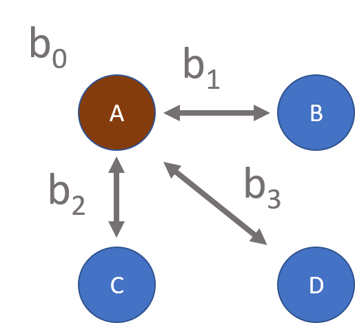
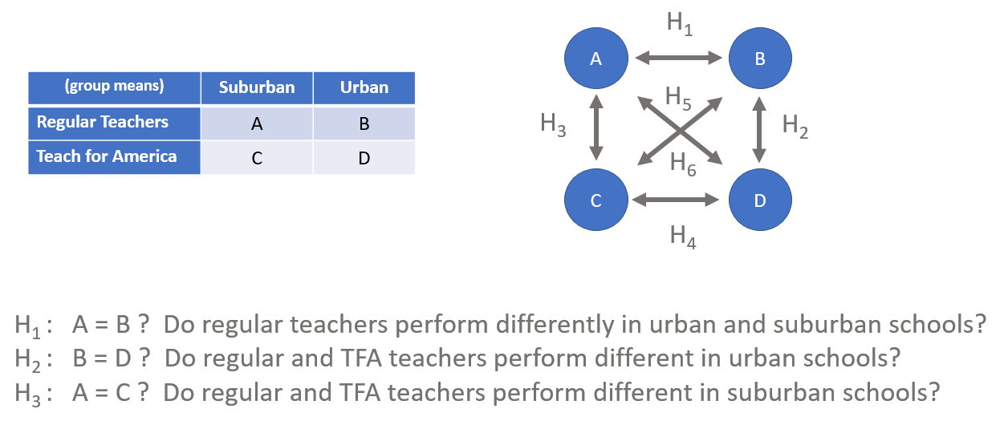
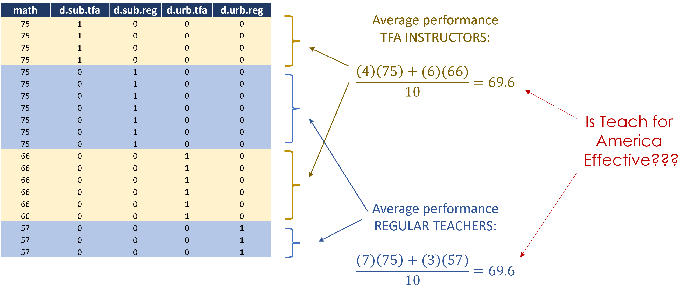

---
title: "Hypothesis Testing"
output:
  html_document:
    theme: readable
    df_print: paged
    highlight: tango
    toc: yes
    toc_float: no
    css: 'lab-instructions.css'
    includes:
      after_body: 'footer.html'
--- 


```{r setup, include=FALSE}
knitr::opts_chunk$set( echo=TRUE, warning=F, message=F )
```


## Overview 

This lab is a review of hypothesis-testing with dummy variables, concepts covered in CPP 523 in the lecture [Dummy Variables and Hypothesis Tests](https://github.com/Watts-College/cpp-524-fall-2021/raw/main//pubs/hypotheses-tests-with-dummy-variables.pdf).

Specifically, the lab reminds us that when we construct groups using dummy variables we will always have a reference group captured by the intercept, and all dummy coefficients represents contrasts with that baseline group. 

 


In the scenario where we have four groups we can test up to six hypotheses with our data, but we can at most test three at a time in any given model. Therefore we must select a reference group and dummy variables that correspond with the hypotheses of interest. 

<hr> 


 

<hr>

This lab uses a fake data set based upon the example of Regular and Teach for America instructors in the lecture notes. Regular instructors have a college degree in education, whereas Teach for America instructors have college degrees in fields other than education, but get credentialed in education through an immersion program that includes specialized training and mentoring. 

Your job is to select a model that aligns with the hypothesis of interest in each question. 


## Setup 

```{r}
library( dplyr )     # data wrangling
library( pander )    # formatting 
library( stargazer ) # pretty regression tables 
```


```{r}
d <- read.csv( "https://raw.githubusercontent.com/Watts-College/cpp-524-fall-2021/main/labs/data/teach-for-america.csv" )
head( d ) %>% pander()
```

* **tfa.dummy** = 1 for all TFA instructors, 0 otherwise 
* **reg.dummy** = 1 for all Regular instructors, 0 otherwise 
* **sub.dummy** = 1 for all Suburban schools, 0 otherwise 
* **urb.dummy** = 1 for all Urban Schools, 0 otherwise 

<br>
<br>

**Study Group Means:** 

```{r}
d %>% 
  group_by( teacher, school ) %>% 
  summarize( ave.score=mean(score) ) %>% 
  pander( digits=0 )
```


## Question 1

Consider the following models:  

$Model \space (1): \space \space score = b_0 + b_1 \cdot tfa + b_2 \cdot suburban$

$Model \space (2): \space \space score = b_0 + b_1 \cdot tfa + b_2 \cdot suburban + b_3 \cdot tfa \cdot suburban$

*Note that we use a colon instead of multiplication sign to interact coefficients in the R lm() syntax:*


```{r, results="asis"}
m1 <- lm( score ~ tfa.dummy + sub.dummy, data=d )
m2 <- lm( score ~ tfa.dummy + sub.dummy + tfa.dummy:sub.dummy, data=d )

stargazer( m1, m2, 
           type="html", digits=3,
           intercept.bottom = FALSE,
           omit.stat = c("ser","f","rsq","adj.rsq") )
```

--------  

Calculate the four group means with regression coefficients from **Model (1)**:

* **Q1-a**: b0 = regular urban teachers 
* **Q1-b**: b0 + b1 = tfa urban teachers  
* **Q1-c**: b0 + b2 = regular suburban teachers  
* **Q1-d**: b0 + b1 + b2 = tfa surburban teachers  

--------

<br>

Are any of these means correct? Here is the table of group means for reference: 

```{r}
tapply( d$score, list(d$teacher,d$school), mean ) %>% 
  round(0) %>% pander()
```

## Question 2

Now calculate the four group means with coefficients from **Model (2)**:

* **Q2-a**: b0 = regular urban teachers 
* **Q2-b**: b0 + b1 = tfa urban teachers   
* **Q2-c**: b0 + b2 = regular suburban teachers  
* **Q2-d**: b0 + b1 + b2 + b3 = tfa surburban teachers 

Are these means correct? 

----------

## Question 3

Why do we need to include the interaction term to recover the true group means?  

If you want to make sense of the issue using geometry note that in a model without an interaction term the groups will always form a **parallelogram** because the final group mean can only be a linear combination of the two dummy variables coefficients: b1+b2 or b2+b1 (up and over vs over and up). 

$Model \space (1): \space \space score = b_0 + b_1 \cdot tfa + b_2 \cdot suburban$

On a piece of paper draw an x-axis with the two groups labeled Regular and TFA. The y-axis will be the outcome. Draw four dots represent the four group means you found in Question 1. Connect the four dots to form a square. 

Now add the actual group means to the diagram: 

```{r, echo=F}
tapply( d$score, list(d$teacher,d$school), mean ) %>% 
  round(0) %>% pander()
```

Regressions attempt to minimize the sum-of-squared-errors in a model. When X is continuous the model produces a slope and intercept that are selected to minimize the squared residual. In a model with all dummy variables we are trying to minimize the distance between the predicted mean of each group (red dots) and all of the observations in the group, represented by the blue dots here (it's the average of the observations, not the observations themselves, in this diagram for the sake of simplicity). 

```{r, echo=F}
# m.tfa.urb <- 77.5
# m.tfa.sub <- 64.3
# m.reg.urb <- 60.4
# m.reg.sub <- 73.6
# 
# x.tfa.urb <- 66
# x.tfa.sub <- 75
# x.reg.urb <- 57
# x.reg.sub <- 75

plot( c(1,1,2,2), c(57,75,66,75),
      ylim=c(55,80), xlim=c(0.5,2.5), 
      pch=19, col="steelblue", cex=2,
      bty="n", xaxt="n", xlab="",
      ylab="Ave Student Score" )

axis( side=1, at=c(1,2), labels=c("Reg","TFA") )

points( c(1,1,2,2), c(60.4,73.6,64.4,77.6),
        pch=19, col="firebrick", cex=2 )

polygon(x=c(1,1,2,2), y=c(60.4,73.6,77.6,64.4), 
        border="firebrick", col = NA )
     
```

What should be visually apparent is that you cannot shift the red box up or down in any way to achieve a smaller residual in the model. You are seeing here the parallelogram produced by Model 1 which minimizes the residual subject to the constraints of the model (only two degrees of freedom). 

Note that Model 1 gets **none** of the group means correct. Why is that? 

<br>

Back to the question - **why do we need the interaction term to provide proper model fit?** 

How does the interaction allow us to fit the data with a polygon instead of a parallelogram? How many additional degrees of freedom do we need for this? 


```{r,echo=F}
plot( c(1,1,2,2), c(57,75,66,75),
      ylim=c(55,80), xlim=c(0.5,2.5), 
      pch=19, col="steelblue", cex=2,
      bty="n", xaxt="n", xlab="",
      ylab="Ave Student Score" )

axis( side=1, at=c(1,2), labels=c("Reg","TFA") )

polygon(x=c(1,1,2,2), y=c(57,75,75,66), 
        border="steelblue", col = NA )

points( 2, 57, cex=2, col="steelblue" )
```

Recall the Seven Sins of Regression from CPP 523. 

This is another example of **specification bias**, which occurs when we have all of the variables we need to fit a model properly but we need to use the right specification or we will get poor coefficient values because of constraints we have imposed on the data, not because of poor data or omitted variable bias. 


<br>
<hr>
<br>


## Question 4

Explain the hypothesis associated with each coefficient in **Model (2)**:

* **Q4-a**: b0 ?  
* **Q4-b**: b1 ?  
* **Q4-c**: b2 ?  
* **Q4-d**: b3 ?  

<br>
<hr>
<br>


## Question 5

Run baseline model comparing performance of Regular instructors to TFA instructors. Do not control for school geography in this model (urban vs suburban schools). 

$score = b_0 + b_1 \cdot tfa.dummy$


```{r, results="asis"}
m0 <- lm( score ~ tfa.dummy, data=d )

stargazer( m0, 
           type="html", digits=3,
           intercept.bottom = FALSE,
           omit.stat = c("ser","f","rsq","adj.rsq") )
```


Do we find differences in performance across teacher types now? Report your decision criteria. 

<hr>




<hr> 

This is an example of [**Simpson's Paradox**](https://en.wikipedia.org/wiki/Simpson%27s_paradox). When you have unequal group sizes (the number of observations per group) and you aggregate groups for a comparison, you can introduce bias into your comparisons. 

```{r}
tapply( d$score, d$teacher, mean ) %>% 
  round(0) %>% pander()
```

Even when we know they exist: 

```{r}
tapply( d$score, list(d$teacher,d$school), mean ) %>% 
  round(0) %>% pander()
```

This occurs specifically in our sample because TFA instructors are more likely to work in urban schools and Regular instructors are more likely to work in suburban schools: 

```{r}
table( d$teacher, d$school ) %>% pander()
```

In other words, Simpson's Paradox is another word for a selection problem. If we don't account for the selection process (in this instance by controlling for school geography) then we will improperly conclude there is no performance difference between teacher type. 

In reality, TFA and Regular instructors perform the same in suburban schools. But TFA instructors perform better in urban schools. You need to compare them within-context in order to avoid Simpson's Paradox.


<br>
<hr>
<br>

## Question 6

Now run a model comparing teacher performance in urban schools. 

$Model \space (3): \space \space score = b_0 + b_1 \cdot tfa + b_2 \cdot urban + b_3 \cdot tfa \cdot urban$

```{r, results="asis"}

m3 <- lm( score ~ tfa.dummy + urb.dummy + tfa.dummy:urb.dummy, data=d )

stargazer( m3, 
           type="html", digits=3,
           intercept.bottom = FALSE,
           omit.stat = c("ser","f","rsq","adj.rsq") )
```

* **Q6-a**: What does baseline group b0 represent? 
* **Q6-b**: which coefficient represents our hypothosis of interest? 
* **Q6-c**: What does b3 test? 


## Question 7

**Q7-a**: which model allows us to test whether Regular instructors perform differently in urban versus suburban schools? 

**Q7-b**: which model allows us to test whether TFA instructors perform differently in urban versus suburban schools? 

## Challenge Question 

What is the minimum number of regression models you need to run to test all six hypotheses in the TFA vs Regular at Urban vs Suburban Schools example? 

Report which models you would run and the hypotheses associated with each coefficient. 


<br>
<br>
<hr>
<br>
<br>

